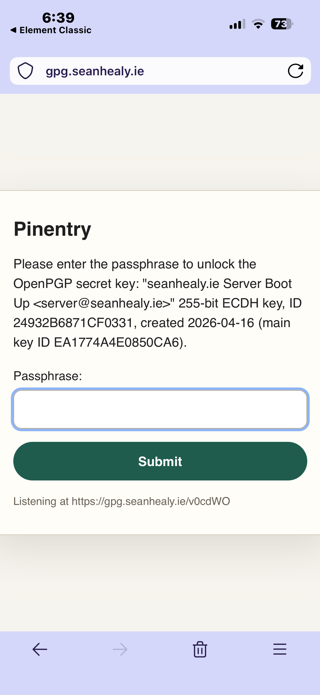

# `web-pinentry`: decrypt server keys from your phone

`web-pinentry` is a [pinentry](https://github.com/gpg/pinentry) program for
Linux servers, allowing you to decrypt keys on your server remotely via your
phone.  It relies on HTTP and the Matrix protocol.  This is a modern approach to
tasks often faced during server boot up, when things like SQL passwords and API
tokens need to be ascertained before services can begin.

Sensitive server credentials are historically stored in environment variable
files.  Though this legacy approach eases automated server startup, it carries a
huge cost in terms of security.  If the server becomes compromised, passwords
and other sensitive information within environment variables and plaintext
config files poses a security threat.  Server admins may ultimately
feel compelled to reject server access to engineers or technicians lest they
gain knowledge of crucial passwords in config files.

To solve this headache, passwords can be encrypted with a GPG wrapper tool such
as `pass`.  Rather than pulling passwords from a file, they are obtained through
subprocess calls, e.g.

`pass sql-root-password`
`pass github-token`

This is standard practice on desktops, but not yet on servers.

`web-pinentry` attempts to make this workflow more feasible on servers.  Programs
typically pause for user authentication when executing GPG or `pass` commands.  On desktop,
a user may types a password or inserts a Yubi key before things can resume. `web-pinentry`
does not assume the user has physical access to the computer, taking a radically
different yet somewhat simple approach.

## How `web-pinentry` works

`web-pinentry` is designed to override the builtin GPG `pinentry` program:
Rather than waiting for a password to be typed in the same terminal as the
current process, `web-pinentry` awaits a user password over the network
via a temporary login link.  Here is an example of this altered workflow:

- An engineer reboots a server.
- The init system (systemd or otherwise) starts up the various services.
- Among these is a Scala REST API that attempts to reach a remote DB.
- In the Scala code, a subprocess is used to configure the SQL password:
  - I.e. `pass sql-root-password` is executed as the REST API spins up.
- Under the hood, GNU `pass` attempts to decrypt a master-password-protected
  file containing the SQL login details.
- This triggers a pinentry program which seeks the master password.

Usually this is the point at which most naively configured systems would
hang or timeout.  However, with `web-pinentry` as your default pinentry program,
the workflow continues unininterupted:

- GPG communicates with `web-pinentry`, and the latter spins up a temporary
  HTTP server.
- On this HTTP server, there is exactly one randomly generated path.
- This path is sent as a URL to a Matrix channel, where the system admin
  can then enter the GPG master password.
- Passwords and API keys are then momentarily available for the server's
  startup procedure.

## Security Details

- Login paths only live for two GET requests, and the pinentry program must
  therefore try again with a new link if you type your password wrong.
- `web-pinentry`'s HTTP server only responds to requests made via docker
  network IPs or localhost.
  - It's imperative to run web-pinentry behind a HTTPS proxy (recommendation: `caddy`).
- All paths that are not the login path are restricted.
- The login link is sent to Matrix via `matrix-commander-rs`, which needs to be
  configured in advance.
- The login link is randomly generated anew on each invocation.
- Once a password is entered correctly, the HTTP server is torn down.

**WARNING**: It is highly recommended to use a GPG master password that is randomly generated
and stored within a password manager.  This protects you from phishing attacks
and can further automate the pinentry workflow.  Without this protection, a bad
actor could create a visually similar website to the `web-pinentry` default
login, and attempt to prompt you for your password.

## Requirements

- [`matrix-commander-rs`](https://github.com/8go/matrix-commander-rs)
- [Matrix](https://matrix.org/)
  - Your Matrix user
  - A Matrix bot user (just a normal user with a noticeable username like `notification-bot`)
  - A private Matrix channel between you and the bot (preferably encrypted).
  - A Matrix client app for mobile, e.g. [Element](https://element.io/)
- A proxy server with HTTPS support (E.g. [`caddy`](https://caddyserver.com/))
- A DNS subdomain/domain you control.
For development contributors only:
- [`rust`](https://rust-lang.org/)

## Installation instructions

Building and installing the `web-pinentry` program:

```{bash}
# Build the web-pinentry program
cargo build
# Copy the program to a PATH directory
sudo cp target/debug/web-pinentry /usr/bin
```

Install a Matrix client on your phone.  Sign up (on the default server, or your
own self-hosted one), and log in.  Once you've done that, create a private
channel with a name like *GPG Login Requests*.  Create another Matrix user that
will be used as a bot account.  Again, give it a recognisable username like
`gpg-bot`.  Logged in as your own Matrix user again, invite the bot to the private
channel you created.  Logged in as the bot once more, accept the
invitation.  Don't log out as the bot just yet, until the following steps have been
completed.

You should now have a properly set up Matrix user, bot user and a channel shared
by each.  Next, install `matrix-commander-rs` on your server, which will be used
by the bot to send messages to you:

```{bash}
git clone https://github.com/8go/matrix-commander-rs
cd matrix-commander-rs
cargo build
sudo cp target/debug/matrix-commander-rs /usr/bin
```

Linking your bot to matrix-commander-rs:

```{bash}
matrix-commander-rs \
    --login password \
    --user-login \
    @gpg-bot:matrix.org \
    --password <BOT PASSWORD> \
    --device web-pinentry \
    --room-default '!room_id:matrix.org' `
    --homeserver 'https://matrix.org'
```

Testing that you can receive messages from the bot:

```{bash}
matrix-commander-rs --message 'Hello world!'
```

The above should trigger a notification on your phone via the Matrix client app
you have installed.

You might notice the message come with a warning about the bot's client.
On the app you used to login to the bot account earlier, go into settings
and manually verify that the web-pinentry client is legitimate.  You can
use emoji verification if you want to do this with maximal security.

On your Matrix phone app or desktop client, you can now log out of the bot account.
It will only ever communicate via messages from your server from now on.

Ensure you're logged into your Matrix account on your phone app to receive security
requests in your shared channel with the bot.

Configuring `web-pinentry` as the default GNUPG pinentry program:

```{bash}
if [ ! "$GNUPGHOME" ]; then GNUPGHOME="$HOME/.gnupg"; fi
AGENT_CONF="$GNUPGHOME/gpg-agent.conf"
echo "pinentry-program $(which web-pinentry)" >> "$AGENT_CONF"
```

Testing that the new pinentry program is used:
```{bash}
# Kill the existing gpg-agent, triggering it to restart with the new settings.
kill $(pgrep gpg-agent)
# Run a command that requires GPG master login, e.g.:
pass sql-root-password
```

If all goes well, the above command should hang for a while, and without much
delay you should receive a notification on your phone from the `gpg-bot`,
with a link to a login URL.  Click this link and allow your password
manager to relay your GPG decryption password to the web form.
After submitting this form, you'll notice the `pass sql-root-password`
command is no longer hanging, and has printed the password to the console.
You'll also notice that the previous link and its entire domain are no
longer reachable.


